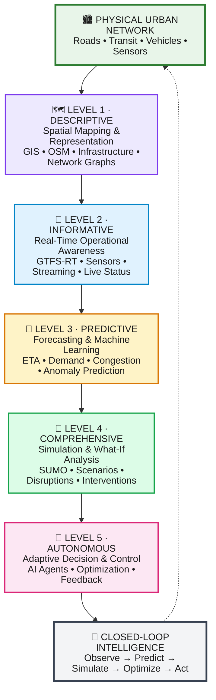
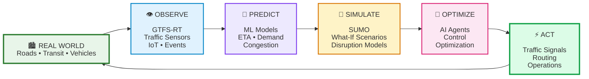
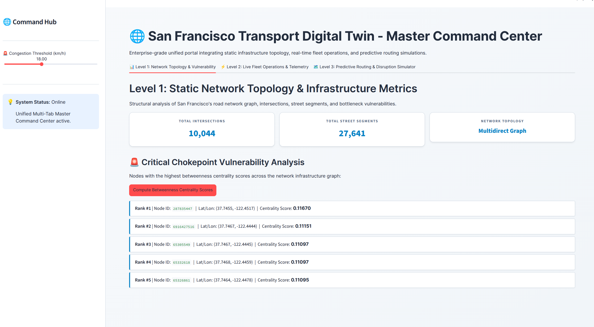
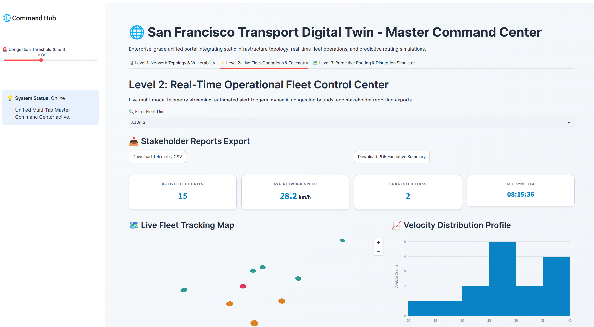
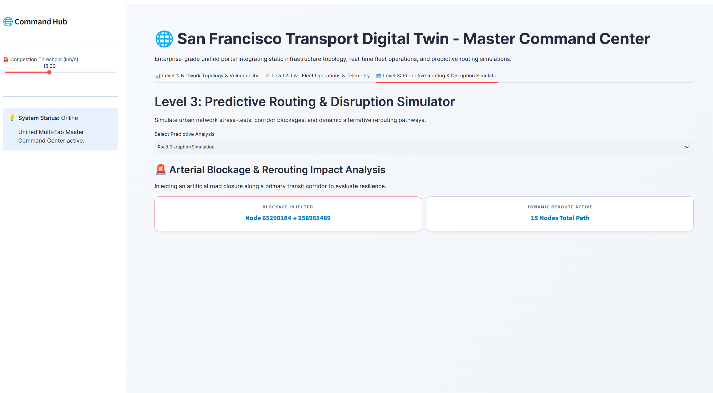
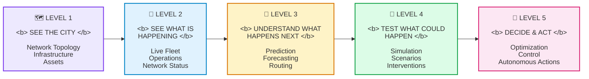
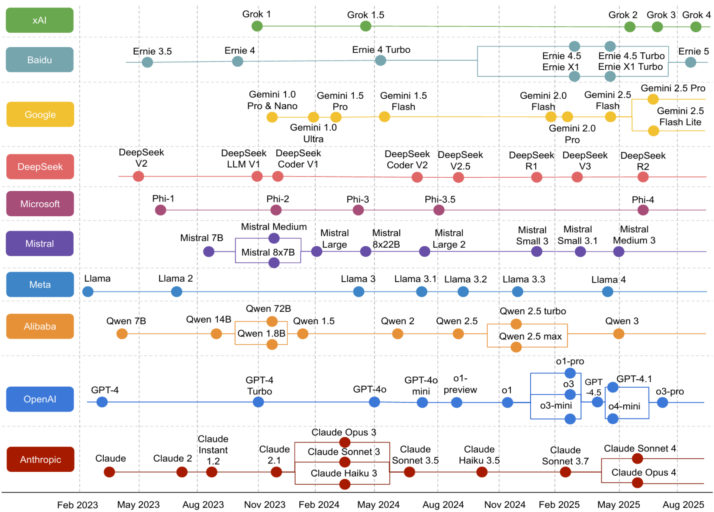
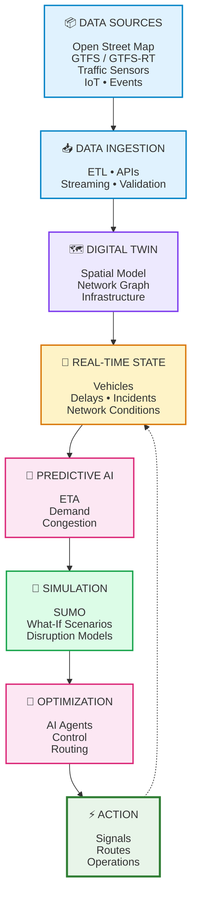

<div align="center">

# 🚇 Multimodal Transportation Digital Twin

### A Progressive 5-Level Framework for Modeling, Monitoring, Simulating, Predicting, and Optimizing Complex Urban Transportation Networks

<br>

**From Static Maps → Real-Time Awareness → Prediction → Simulation → Autonomous Control**

<br>


</div>

---

## 🌆 Overview

The **Multimodal Transportation Digital Twin** is a progressive five-level framework for creating a living digital representation of a complex urban transportation network.

The system evolves from a **static spatial representation** into a **real-time, predictive, simulation-driven, and eventually autonomous transportation intelligence platform**.

It brings together:

* 🗺️ **GIS & OpenStreetMap**
* 🚌 **Public Transit & GTFS / GTFS-Realtime**
* 🚗 **Road Traffic & Mobility Sensors**
* 📡 **Real-Time Data Streaming**
* 🤖 **Machine Learning & Predictive Analytics**
* 🧪 **Traffic Simulation & What-If Analysis**
* 🎯 **Optimization & Autonomous Decision-Making**

The ultimate goal is a closed-loop system capable of **observing the physical city, understanding its current state, predicting future conditions, testing interventions, and optimizing transportation operations**.

---

# 🏗️ Digital Twin Maturity Roadmap

The project progresses through five distinct digital twin maturity levels, moving from spatial representation toward autonomous transportation control.




---

## 🧭 Five-Level Architecture

|  Level | Maturity             | Core Focus             | Key Capabilities                          |
| :----: | :------------------- | :--------------------- | :---------------------------------------- |
| **01** | 🗺️ **Descriptive**   | Spatial Representation | GIS, OSM, network graphs                  |
| **02** | 📡 **Informative**   | Real-Time Awareness    | GTFS-RT, sensors, live dashboards         |
| **03** | 🔮 **Predictive**    | Forecasting & ML       | ETA, demand, congestion prediction        |
| **04** | 🧪 **Comprehensive** | Simulation             | SUMO, scenarios, disruption analysis      |
| **05** | 🤖 **Autonomous**    | Decision & Control     | Optimization, rerouting, adaptive control |

---

# 🗺️ Level 1 — Descriptive Digital Twin

### Spatial Mapping & Infrastructure Representation

Level 1 establishes the spatial foundation of the transportation digital twin.

### Key Features

* 🛣️ OpenStreetMap road networks
* 🚉 Transit stations and stops
* 🗺️ GIS-based infrastructure visualization
* 🔗 Multimodal network graphs
* 📍 Geographic asset inventories
* ⚠️ Infrastructure vulnerability analysis
* 🏙️ Static transportation topology

### Primary Output

> A complete spatial representation of the transportation system.

---

# 📡 Level 2 — Informative Digital Twin

### Real-Time Operational Awareness

Level 2 connects the digital twin to the continuously changing physical transportation network.

### Key Features

* 🚌 GTFS-Realtime vehicle positions
* ⏱️ Live arrival and departure information
* 🚦 Traffic sensor streams
* 🚧 Incident and disruption monitoring
* 📊 Real-time operational dashboards
* 🔴 Fleet status monitoring
* 📡 Streaming transportation data

### Primary Output

> A continuously updated operational view of the city.

---

# 🔮 Level 3 — Predictive Digital Twin

### Forecasting & Machine Learning

Level 3 moves from understanding **what is happening now** to predicting **what is likely to happen next**.

### Key Features

* ⏱️ ETA forecasting
* 👥 Passenger demand prediction
* 🚗 Congestion forecasting
* 🚌 Delay prediction
* 🛣️ Travel-time prediction
* 🧠 Anomaly detection
* 🔀 Predictive routing

### Primary Output

> Forward-looking transportation intelligence.

---

# 🧪 Level 4 — Comprehensive Digital Twin

### Simulation & What-If Analysis

Level 4 introduces a virtual transportation laboratory where interventions can be evaluated before they are applied to the real network.

### Key Features

* 🚗 Microscopic traffic simulation
* 🛣️ Mesoscopic transportation modeling
* 🧪 SUMO integration
* 🚧 Disruption scenarios
* 🚦 Traffic signal experiments
* 🔀 Alternative routing strategies
* 📈 Policy and intervention evaluation

### Example Questions

**What happens if a major arterial road is closed?**

**What happens if a metro line experiences a 20-minute disruption?**

**How does a change in traffic signal timing affect network-wide congestion?**

**Which rerouting strategy minimizes passenger delay?**

### Primary Output

> A simulation environment for evaluating transportation decisions before deployment.

---

# 🤖 Level 5 — Autonomous Digital Twin

### Agentic AI, Optimization & Closed-Loop Control

Level 5 transforms the digital twin from an analytical platform into an adaptive decision-making system.

### Key Features

* 🚦 Dynamic traffic signal optimization
* 🔀 Automated multimodal rerouting
* 🤖 AI-based decision agents
* ⚡ Real-time optimization
* 🎯 Network-wide objective optimization
* 🔄 Closed-loop feedback
* 🧠 Adaptive transportation control

### Primary Output

> An adaptive transportation intelligence system capable of recommending and eventually executing optimized interventions.

---

# 🔄 Closed-Loop Intelligence

The final architecture connects the digital twin back to the physical transportation network.



---

# 📸 Digital Twin Command Center

The project includes visual snapshots demonstrating the evolution of the digital twin across its first three maturity levels.

<div align="center">

## Level 1 — Network Topology & Infrastructure



**Descriptive Digital Twin**

*Spatial network topology, infrastructure representation, and vulnerability analysis.*

</div>

---

<div align="center">

## Level 2 — Real-Time Operational Fleet Control Center



**Informative Digital Twin**

*Live fleet operations, vehicle positions, network status, and real-time monitoring.*

</div>

---

<div align="center">

## Level 3 — Predictive Routing & Disruption Simulator



**Predictive Digital Twin**

*Predictive routing, congestion forecasting, and disruption scenario analysis.*

</div>

---

# 🖥️ Command Center Evolution

The dashboards progressively evolve with the maturity of the digital twin.



The multimodal ecosystem has expanded significantly, marked by the maturation of native cross-modal architectures, massive context extensions (reaching up to 10 million tokens in open-weight models like **Llama 4 Scout**), and deeply integrated agentic reasoning.

The updated state of frontier Multimodal Large Language Models (MLLMs) covers major tech entities and labs:

---

# 🌐 Frontier MLLM Ecosystem & Latest Capabilities

* **OpenAI (GPT-5 / GPT-5.5 / o-Series Reasoning)**
* *Current Landscape:* Driven by **GPT-5.5** and advanced reasoning models (o3/o4).
* *Multimodal Focus:* Deeply integrated agentic workflows, advanced visual synthesis, complex tool-use execution, and high-precision multi-step data interpretation.


* **Google DeepMind (Gemini 3 / 3.5 Flash & Pro Era)**
* *Current Landscape:* Spearheaded by **Gemini 3.5 Flash** and Gemini 3 Pro series.
* *Multimodal Focus:* The industry benchmark for native, low-latency omni-processing across simultaneous text, image, long-form audio, and high-definition video streams with expansive context windows.


* **Anthropic (Claude 4 / 4.5 / Opus 4.7 & 4.8 Series)**
* *Current Landscape:* Anchored by the **Claude 4** family and iterative updates like **Opus 4.7/4.8** and **Sonnet 4.6**.
* *Multimodal Focus:* Unmatched code reasoning, exact technical diagram parsing, multi-file software analysis, and rigorous document compliance checks.


* **Meta (Llama 4 Scout & Maverick / SAM 3 Vision)**
* *Current Landscape:* Revolutionized open-weights infrastructure via the **Llama 4** generation (featuring extreme long-context variants like *Llama 4 Scout* with up to 10M token context) alongside specialized zero-shot segmentation vision tools like **SAM 3**.
* *Multimodal Focus:* Democratizing private, local enterprise deployment with data privacy compliance and cross-modal native scaling.


* **Alibaba Cloud (Qwen3-VL / Qwen3-Coder)**
* *Current Landscape:* The latest **Qwen3-VL** iterations.
* *Multimodal Focus:* Exceptional spatial-temporal grounding, multilingual optical character recognition (OCR), layout-aware document ingestion, and advanced agentic GUI navigation.


* **DeepSeek (DeepSeek-V4 Flash / Pro & OCR-2)**
* *Current Landscape:* Powered by highly efficient Mixture-of-Experts (MoE) architectures like **DeepSeek V4 Flash** alongside specialized visual layout parsers like **DeepSeek-OCR 2**.
* *Multimodal Focus:* Drastically slashing inference costs (up to orders of magnitude cheaper than premium tiers) while retaining top-tier coding, logic, and structured document extraction capabilities.


* **xAI (Grok 4 / 4.3 Series)**
* *Current Landscape:* Scaled through **Grok 4.3** and fast variants.
* *Multimodal Focus:* Real-time integration with live global data streams, configurable reasoning depth per request, and low-latency operational monitoring.


* **Mistral AI (Mistral Large 3 & Medium 3.5)**
* *Current Landscape:* Led by **Mistral Large 3** (frequently under Apache 2.0 or open-weights friendly licenses).
* *Multimodal Focus:* Providing European enterprises with natively multimodal, data-residency-compliant, high-performance self-hosted models.


* **Baidu (ERNIE 4.5 / Native Multimodal Ecosystem)**
* *Current Landscape:* Ongoing upgrades to the ERNIE line.
* *Multimodal Focus:* Robust domestic Chinese language-vision parsing, cross-modal retrieval, and large-scale industrial enterprise deployment.


* **Microsoft (Phi-4 Multimodal & Florence Series)**
* *Current Landscape:* **Phi-4 Multimodal**.
* *Multimodal Focus:* Edge-optimized intelligence designed for low-latency processing on local hardware, smart devices, and resource-constrained environments.

---

<div align="center">

## 🧠 State-of-the-Art Frontier MLLM Ecosystem



**Global MLLM Landscape & Timeline**

*Mapping foundational multi-modal evolution—covering OpenAI, Google, Anthropic, Meta, Alibaba, DeepSeek, xAI, Mistral, Baidu, and Microsoft—as the core intelligence drivers for predictive and autonomous transportation digital twins.*

</div>

---

# 📁 Repository Structure

```text
transport-digital-twin/
│
├── 📂 data/
│   ├── raw/                       # Raw GTFS, OSM & sensor data
│   └── processed/                 # Cleaned and processed datasets
│
├── 📂 docs/
│   └── architecture-mapping.md    # Architecture & specifications
│
├── 📂 level-1-descriptive/        # 🗺️ Static spatial model
│
├── 📂 level-2-realtime/           # 📡 Real-time streams & dashboard
│
├── 📂 level-3-predictive/         # 🔮 ML forecasting models
│
├── 📂 level-4-comprehensive/      # 🧪 Simulation & scenario twin
│
├── 📂 level-5-autonomous/         # 🤖 Optimization & feedback loops
│
├── 📂 results/                    # 📸 Dashboard snapshots
│   ├── Level_1.png
│   ├── Level_2.png
│   └── Level_3.png
│
├── 📂 scripts/                    # Reusable utility scripts
│
└── 📄 README.md                   # Project overview
```

---

# 🔗 Core Data & Intelligence Pipeline



---

# 🎯 Project Vision

The ultimate objective is to create a transportation digital twin capable of continuously answering six increasingly sophisticated questions:

```mermaid
---
config:
  htmlLabels: false
---
flowchart LR
    Q1["🗺️ WHAT IS <br/> HAPPENING?"]
    Q2["📡 WHAT IS HAPPENING <br/> RIGHT NOW?"]
    Q3["🔮 WHAT WILL HAPPEN <br/> NEXT?"]
    Q4["🧪 WHAT COULD HAPPEN <br/> IF WE INTERVENE?"]
    Q5["🎯 WHAT SHOULD <br/> WE DO?"]
    Q6["🤖 CAN THE SYSTEM <br/> ACT AUTOMATICALLY?"]

    Q1 --> Q2 --> Q3 --> Q4 --> Q5 --> Q6

    classDef q1 fill:#ede9fe,stroke:#7c3aed,stroke-width:2px
    classDef q2 fill:#e0f2fe,stroke:#0284c7,stroke-width:2px
    classDef q3 fill:#fef3c7,stroke:#d97706,stroke-width:2px
    classDef q4 fill:#dcfce7,stroke:#16a34a,stroke-width:2px
    classDef q5 fill:#fce7f3,stroke:#db2777,stroke-width:2px
    classDef q6 fill:#e8f5e9,stroke:#2e7d32,stroke-width:3px

    class Q1 q1
    class Q2 q2
    class Q3 q3
    class Q4 q4
    class Q5 q5
    class Q6 q6
```



This progression transforms raw transportation data into:

**Situational Awareness → Prediction → Simulation → Optimization → Autonomous Decision-Making**

---

<div align="center">

# 🚇 From Mapping the City to Operating the City

### Observe → Understand → Predict → Simulate → Optimize → Adapt

<br>

**Multimodal Transportation Digital Twin**

</div>

