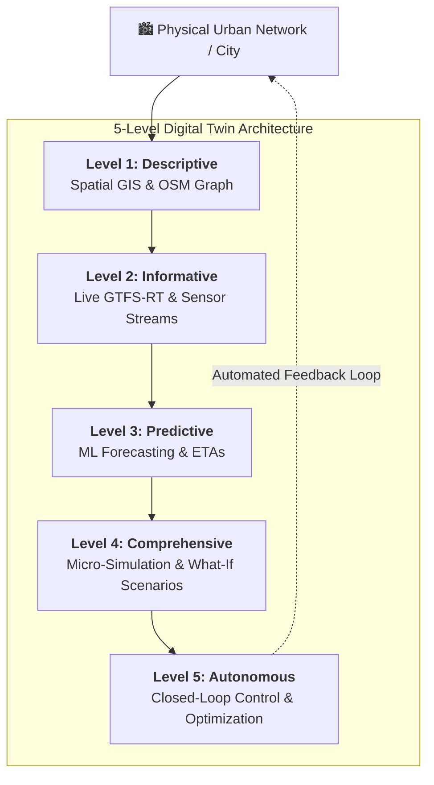

# Multimodal Transportation Digital Twin

A progressive, 5-level digital twin framework for modeling, monitoring, simulating, and optimizing complex urban transportation networks.

---

## 🏗️ Project Maturity Roadmap

This project evolves through 5 distinct digital twin maturity levels, transitioning from static spatial representation to closed-loop autonomous control:

1. **Level 1: Descriptive / Monitoring Digital Twin** (`/level-1-descriptive`)
   - **Core Focus:** Spatial Mapping & Representation.
   - **Key Features:** GIS networks, OpenStreetMap (OSM) road links, station coordinates, and static transit infrastructure graphs.
2. **Level 2: Informative / Real-Time Operational Twin** (`/level-2-realtime`)
   - **Core Focus:** Sensing & Real-Time Ingestion.
   - **Key Features:** Live GTFS-Realtime feeds, traffic sensor streams, and real-time operational status dashboards.
3. **Level 3: Predictive Digital Twin** (`/level-3-predictive`)
   - **Core Focus:** Inference & Machine Learning.
   - **Key Features:** ETA forecasting models, passenger demand prediction, and traffic congestion trend analysis.
4. **Level 4: Comprehensive Digital Twin** (`/level-4-comprehensive`)
   - **Core Focus:** Simulation & Modeling.
   - **Key Features:** Micro/meso-scopic traffic simulations (e.g., SUMO) and disruption "what-if" scenario analysis.
5. **Level 5: Autonomous / Adaptive Digital Twin** (`/level-5-autonomous`)
   - **Core Focus:** Agentic AI & Decision Control.
   - **Key Features:** Dynamic traffic signal optimization and automated multimodal rerouting loops.

---

## 🏛️ Architecture & Documentation



---

## 📁 Repository Structure

```text
transport-digital-twin/
├── data/                       # Shared datasets and GIS maps
│   ├── raw/                    # Raw unprocessed data (GTFS, OSM extracts)
│   └── processed/              # Cleaned and processed datasets
├── docs/                       # Architecture diagrams and specifications
│   └── architecture-mapping.md
├── level-1-descriptive/        # Level 1: Static spatial model & baseline visualization
├── level-2-realtime/           # Level 2: Real-time streams & dashboard
├── level-3-predictive/         # Level 3: ML forecasting models
├── level-4-comprehensive/      # Level 4: Comprehensive simulation & scenario twin
├── level-5-autonomous/         # Level 5: Automated optimization & feedback loops
├── scripts/                    # Reusable utility scripts
└── README.md                   # Project overview and instructions